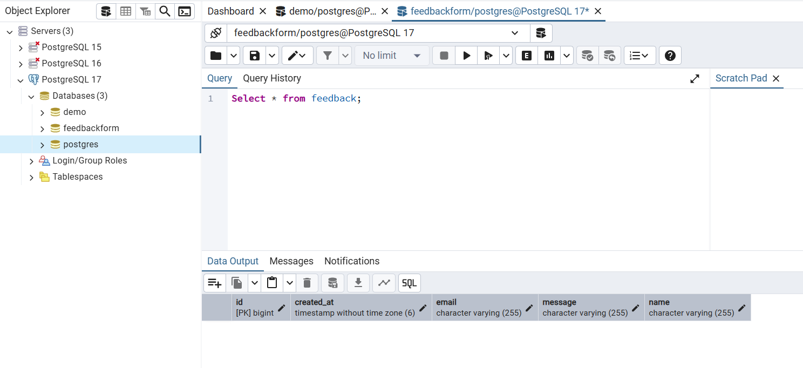
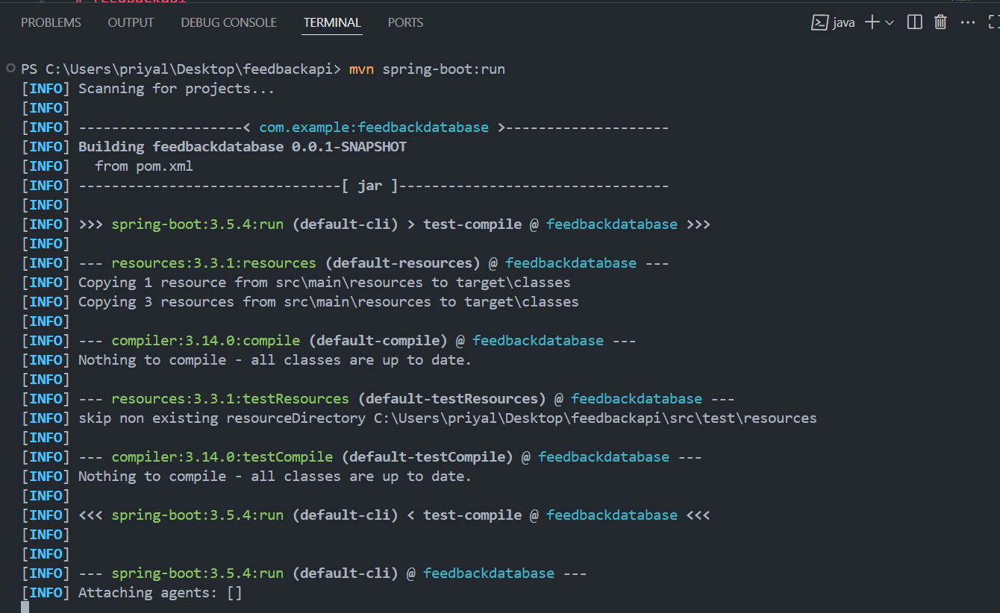
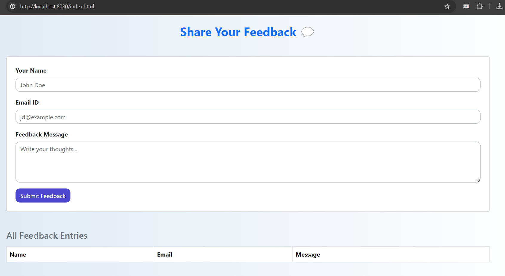
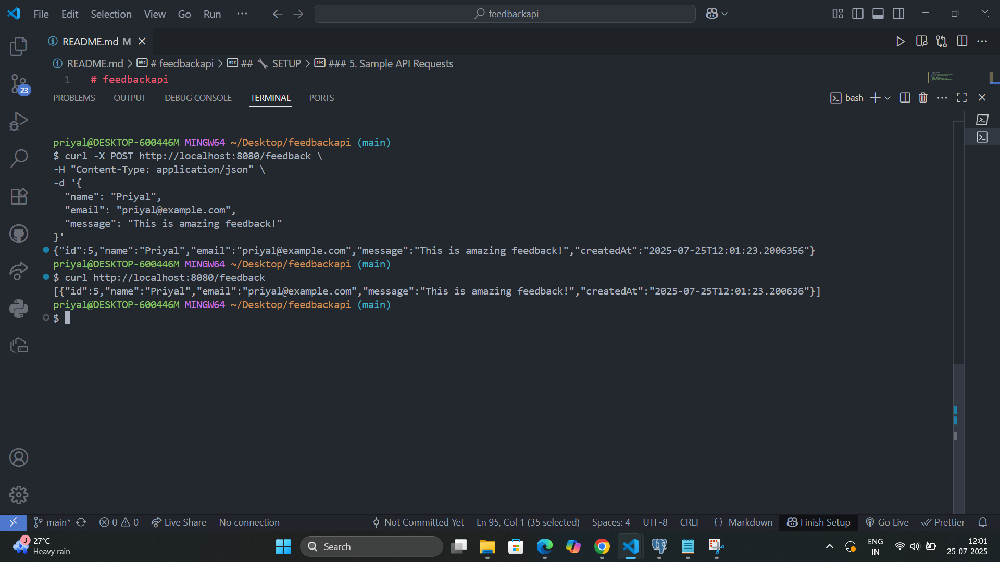
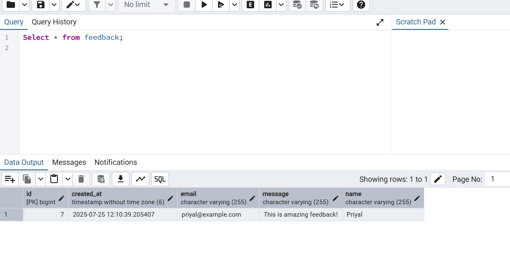
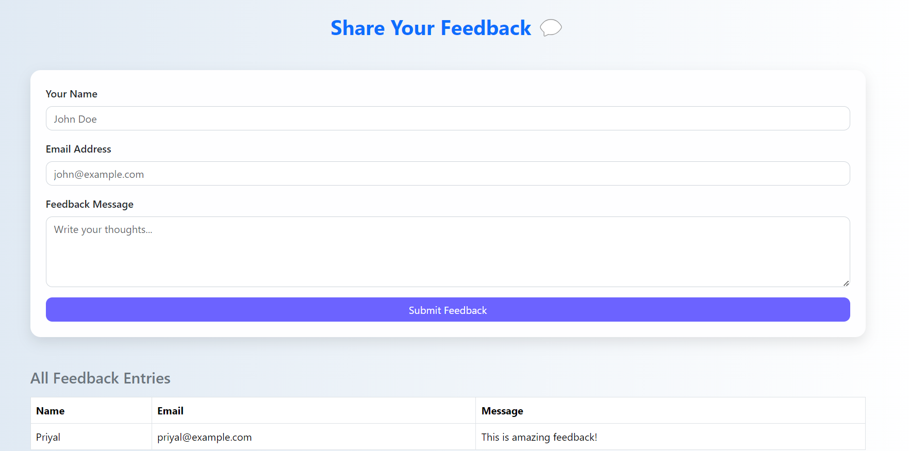
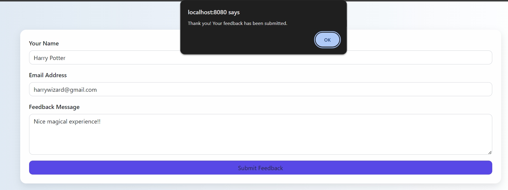
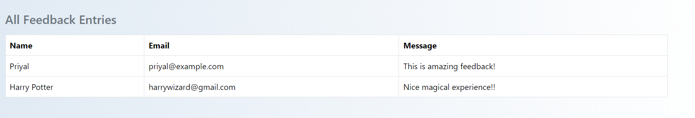
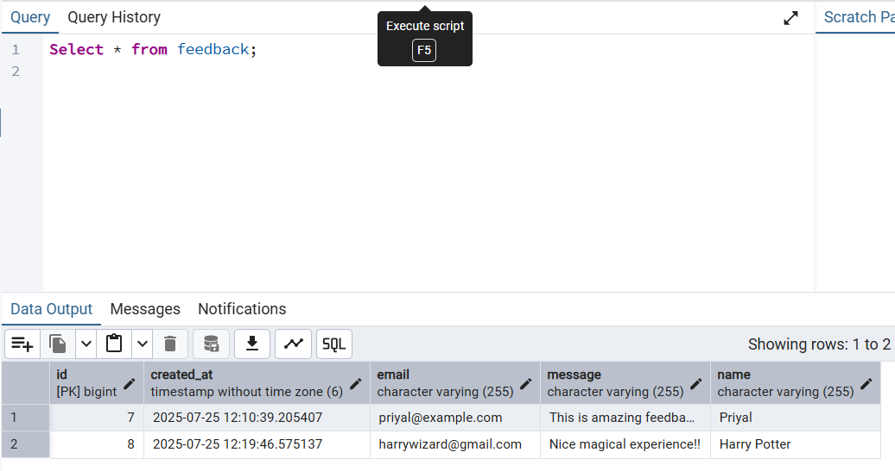
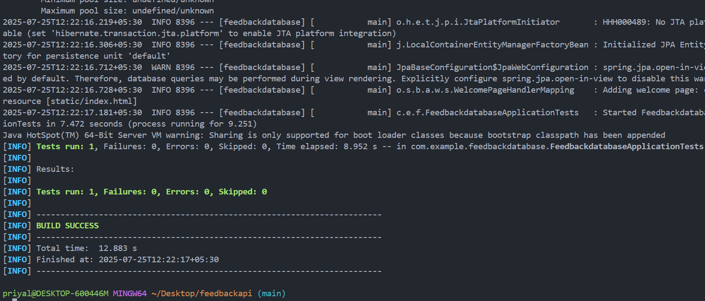

# feedbackapi
📮 Simple Feedback API

A minimal Spring Boot 3.x REST API for submitting and viewing user feedback. Includes a clean HTML + JS frontend and integrates with a PostgreSQL database.

---

## 🚀 Tech Stack

- Java 17+
- Spring Boot 3.x
- Spring Data JPA
- PostgreSQL
- JUnit + Mockito
- HTML, CSS, JS (frontend)(Optional)
- Insomnia / cURL for testing

---

## 📦 Features

- ✅ Submit feedback (with validation)
- ✅ View all feedback entries
- ✅ Store feedback in PostgreSQL
- ✅ (Optional) HTML + JS page to view and submit feedback
- ✅ Fully tested service layer

---

📌 Prerequisites:
- Java 17+
- PostgreSQL running locally on port 5432
- A database named feedbackform

---

## 🛠️ API Endpoints

| Method | Endpoint     | Description              |
|--------|--------------|--------------------------|
| POST   | `/feedback`  | Submit new feedback      |
| GET    | `/feedback`  | Retrieve all feedback    |


---

## 🔧 SETUP

### 1. Clone the repository

```bash
git clone https://github.com/your-username/your-repo-name.git
cd your-repo-name
```

### 2.  Set up PostgreSQL

Create a database named feedbackform
Update application.properties:
```bash
spring.datasource.url=jdbc:postgresql://localhost:5432/feedbackform
spring.datasource.username=your_db_username
spring.datasource.password=your_db_password
```


### 3. Start The Server
```bash
mvn spring-boot:run
```


### 4. Access frontend

You can open it via:  
`http://localhost:8080/index.html`



### 5. Sample API Requests

➕ Submit Feedback
``` bash 
curl -X POST http://localhost:8080/feedback \
-H "Content-Type: application/json" \
-d '{
  "name": "Priyal",
  "email": "priyal@example.com",
  "message": "This is amazing feedback!"
}'
```

📄 Get All Feedback
curl http://localhost:8080/feedback




### 6. WEbpage 
you can also fill the details in feedback form to submit





### 7. Run the maven test

``` bash
mvn test
```

